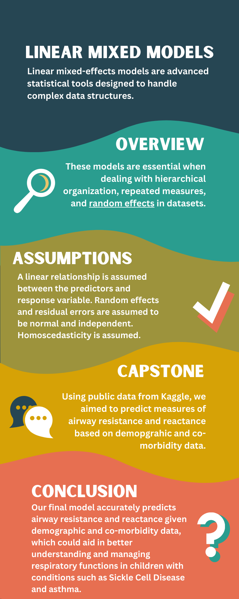

Linear mixed models (LMMs) are statistical models that account for both fixed and random effects. In this report, we provided a systematic review of LMMs, their applications, their limitations, and more. Importantly, we developed this report and by-example analysis of LMMs in R.

As part of Spring 2024 Advanced Statistical Modeling (STA 6257) Capstone Project at the University of West Florida, our team critically analyzed, assessed, and produced a LMM and elaborated on potential applications in a professional report. This website was built using R/Quarto as was the entire project.

This project was completed under the guidance of Dr. Achraf Cohen. 

Here’s a snapshot of the capstone project:

Feel free to learn more on our website: [Linear Mixed Models (jjc54.github.io)](https://jjc54.github.io/STA6257_Project_Linear_Mixed_Modelers/).
