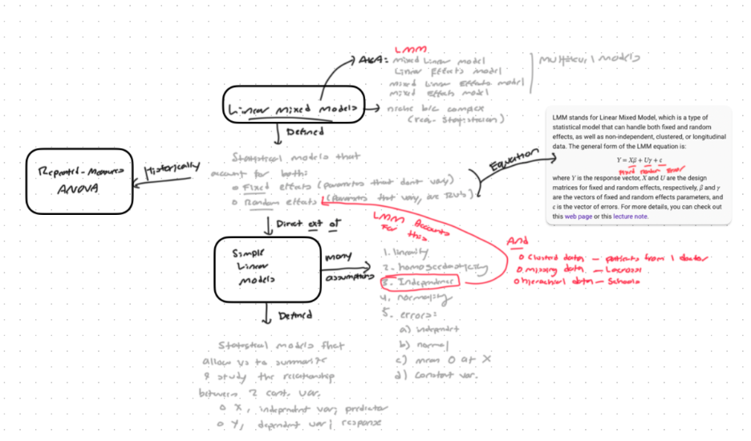

Linear mixed models (LMMs) are statistical models that account for both fixed and random effects. Please follow along as we provide a systematic review of LMMs, their applications, their limitations, and more. Importantly, we will develop a report and by-example analysis of LMMs in R.

Here's a snapshot of the analysis process our team is currently going through:

Feel free to learn more on our website: [Linear Mixed Models (jjc54.github.io)](https://jjc54.github.io/STA6257_Project_Linear_Mixed_Modelers/)
